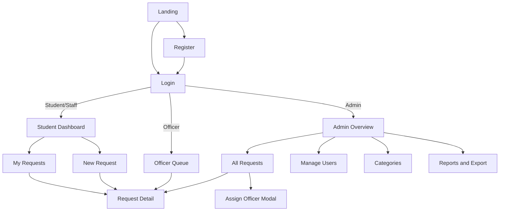

# CampusFix — Frontend Build Brief
*Prompt/spec for Google Antigravity. This is part 1 of 2 for the MIT 8333 project — frontend only. A second brief will cover the Supabase schema, RLS policies, and Edge Functions. Until then, build against mock data behind the seam described in §10, so the app is fully clickable today and gets wired to real data with minimal rework later.*

---

## 1. Role & Goal

You're building the **frontend only** for **CampusFix** (rename freely), a university maintenance and service-request portal. It replaces phone calls, paper forms, WhatsApp messages, and in-person visits with one place where:

- **Students/Staff** report issues — faulty electricity, damaged furniture, leaking pipes, internet problems, classroom equipment, hostel maintenance — and track them through to resolution.
- **Maintenance Officers** work the requests assigned to them and update progress.
- **Administrators** oversee the whole queue, assign work, manage users, and pull reports.

The backend is Supabase (Postgres + Auth + Storage + Realtime), specified separately. For now: build every screen against the thin data-access layer in §10, backed by realistic mock data, so the whole thing is clickable end to end today.

## 2. Roles & Permissions

| Role | Primary goal | Lands on after login |
|---|---|---|
| Student/Staff | Report an issue, track it | My Requests |
| Maintenance Officer | Work their assigned queue | Officer Queue |
| Administrator | Oversee, assign, manage, report | Admin Overview |

New accounts always start as **Student/Staff** — there's no role picker on the registration form. Officer and Admin roles are granted afterward by an existing Administrator from the Users page. This is a deliberate security decision (never let a signup form hand out privilege), not an oversight — worth a line in the project report.

## 3. Recommended Tech Stack

| Concern | Recommendation | Notes |
|---|---|---|
| Framework | React + TypeScript, Next.js (App Router) | Vite + React works too if you'd rather skip SSR — either satisfies the brief |
| Styling | Tailwind CSS | tokens defined in §4 |
| Forms/validation | React Hook Form + Zod | |
| Icons | lucide-react | |
| Tables | TanStack Table, or a hand-rolled `DataTable` (§7) | |
| Charts (admin reports) | Recharts | |
| Toasts/alerts | sonner | |
| Data/auth client | `@supabase/supabase-js`, wrapped by §10 — never called directly from components | |

Different tools are fine if you have a preference — keep the same shape: typed components, one styling system, all data access through a single seam.

## 4. Visual Direction

Ground this in what it actually is: a facilities-operations tool, not a SaaS marketing site. Three different people use it under time pressure — a student reporting a leak from their phone, an officer with a wrench in hand checking a queue, an admin watching the whole board — so fast scanning beats decoration. Avoid the generic gradient-hero/rounded-card AI look entirely.

**Color** (named tokens, not raw hex sprinkled through code):
- `ledger-navy` `#16273E` — headers, nav, dark surfaces
- `worn-gold` `#B8933F` — primary actions, "in progress" signal, active states
- `site-orange` `#C9542C` — urgent priority, destructive actions, "on hold"
- `chalk` `#F4F2ED` — page background
- `ink` `#23262B` — body text
- `resolved-green` `#3F7A57` — completed status only; the one color that isn't in the rest of the palette, reserved so it always reads as "done"

(These lean on the navy/gold/red-orange the university's own materials already use — a facilities tool for that university should feel like it belongs to it, not like a generic template.)

**Type**: a sturdy, slightly condensed grotesk (Archivo or Barlow Condensed) for headings and stat numbers — reads like signage/dispatch-board lettering; a plain, highly legible neutral sans (Inter or IBM Plex Sans) for body, forms, and tables; a monospace (IBM Plex Mono) reserved for ticket IDs and timestamps in logs, so they read as data, not prose.

**Signature detail**: status badges are shaped like a work-order ticket stub — a small dashed inset border standing in for a perforated tear-line — instead of a generic rounded pill. Use it everywhere a status appears (lists, detail page, timeline) and nowhere else; that's the one flourish, everything around it stays quiet.

**Structural device**: every request gets a real-looking ticket ID (e.g. `WO-2031`) in mono type, shown on cards, tables, and the detail page header. It's not decoration — it's the number a student would actually reference if they called to follow up.

**Landing page**: keep it small and honest. One clear line on what the portal replaces, the three roles in one glance, login/register — not an elaborate marketing scroll. This is a utility app; don't spend design budget where nobody will linger.

**Quality floor, non-negotiable**: responsive down to mobile, visible keyboard focus on every interactive element, `prefers-reduced-motion` respected, color never the *only* signal (pair every status color with an icon or label for colorblind users).

**Copy voice**: name things by what people control, not how the system works ("Assign to officer," never "Submit"). Keep verbs consistent through a flow — a button that says "Mark resolved" produces a toast that says "Marked resolved," not "Success." Empty states invite action ("No requests yet — report your first issue" + button), not just "No data." Errors say what happened and what to do about it ("Couldn't save — check your connection and try again"), never a bare error code.

## 5. Site Map



| Route | Role(s) | Purpose |
|---|---|---|
| `/` | Public | Landing page, explains the app, login/register CTAs |
| `/register` | Public | Create account (always as Student/Staff) |
| `/login` | Public | Sign in |
| `/forgot-password` | Public | Request + complete password reset |
| `/app` | All (authenticated) | Redirects to the right dashboard for the caller's role |
| `/app/requests` | Student/Staff | "My Requests" — list + tracking |
| `/app/requests/new` | Student/Staff | Submit a new request |
| `/app/requests/:id` | Owner, assigned Officer, Admin | Request detail (one shared page, actions vary by role) |
| `/app/officer` | Officer | Assigned queue |
| `/app/admin` | Admin | Overview / stats |
| `/app/admin/requests` | Admin | All requests — search, filter, assign |
| `/app/admin/users` | Admin | User list, role changes, activate/deactivate |
| `/app/admin/categories` | Admin | Manage request categories |
| `/app/admin/reports` | Admin | Filters, charts, CSV/PDF export |
| `/app/profile` | All | Name, password, notification prefs |
| `/app/notifications` | All | In-app notification list |
| `*` | — | 404 |

## 6. Page-by-Page Specs

**Landing (`/`)** — Hero line explaining what it replaces, three role summaries, "Log in" / "Create account" CTAs.

**Register (`/register`)** — Fields: full name, email, department/hostel (optional), password, confirm password. Validation: name required; valid email; password ≥ 8 chars with a number; confirm-password match; inline field errors. On submit: loading state on the button, success toast, redirect to login (or straight in, depending on whether email confirmation is on).

**Login (`/login`)** — Email, password, "Forgot password?" link. On success, read the caller's role and redirect to the right dashboard. On failure, show one generic "Incorrect email or password" message — don't reveal whether the email exists.

**Forgot / reset password** — Standard request-link → email → set-new-password flow.

**New Request (`/app/requests/new`)**, Student/Staff — Fields: title; category (Electrical, Plumbing, Furniture, Internet/IT, Classroom Equipment, Hostel Maintenance, Other); location (building + room); priority (Low/Medium/High/Urgent — requester's suggestion, can be overridden later); description (required, min length); evidence photos (drag-drop, up to 3 images, jpg/png, 5MB each). Submit shows a spinner, then a success toast and redirect to the new request's detail page; failure shows a retry-able error.

**My Requests (`/app/requests`)**, Student/Staff — Table of the requester's own tickets: ID, title, category, status badge, submitted date, last update. Search by keyword, filter by status/category, paginate. Empty state: "No requests yet — report your first issue."

**Request Detail (`/app/requests/:id`)**, shared, actions vary by role — Summary block (ticket ID, title, category, location, priority, status, requester, assigned officer), description, evidence gallery, status timeline (chronological, from the log), and role-specific actions:
- *Student/Staff*: read-only, plus "Add more info" (comment) and "Cancel request."
- *Officer*: status control (Acknowledge → In Progress → Resolved/On Hold, each requiring a short note), completion-photo upload.
- *Admin*: everything an officer can do, plus reassign to a different officer, override priority, archive.

**Officer Queue (`/app/officer`)** — List of tickets assigned to the logged-in officer, filterable by status, sorted by priority then age. Click through to detail.

**Admin Overview (`/app/admin`)** — Stat cards (total, open, in progress, resolved this week, overdue), a small bar chart (requests by category) and donut (status breakdown), and a recent-activity feed pulled from the status log.

**All Requests (`/app/admin/requests`)** — Every ticket, full filter set (status, category, officer, date range), per-row "Assign" action opening a modal to pick an officer (optionally scoped to officers whose specialty matches the category).

**Manage Users (`/app/admin/users`)** — Table: name, email, role, joined date, active/disabled. Actions: change role, deactivate/reactivate.

**Categories (`/app/admin/categories`)** — Simple CRUD list: name, description, active toggle.

**Reports (`/app/admin/reports`)** — Date range / category / officer filters, summary numbers, chart(s), "Export CSV" (immediate, client-side) and "Export PDF" buttons.

**Profile (`/app/profile`)**, all roles — Name, password change, notification preferences.

**Notifications (`/app/notifications`)**, all roles — List (e.g. "Ticket WO-2031 moved to In Progress"), mark-as-read, unread badge on the navbar bell.

**404** — Friendly not-found page with a link home.

## 7. Shared Component Library

- **AppShell** — navbar (logo, role-aware links, notification bell, user menu) + responsive sidebar; collapses to a hamburger on mobile.
- **StatusBadge / PriorityBadge** — the ticket-stub style from §4; status colors are semantic (new = slate, in progress = worn-gold, on hold = site-orange, resolved = resolved-green, cancelled = neutral + strikethrough), always paired with an icon or label, never color alone.
- **DataTable** — generic sortable, paginated table; used by My Requests, Officer Queue, Admin Requests, Admin Users.
- **FilterBar** — search input + status/category/date-range dropdowns, reusable across list pages.
- **FileDropzone** — drag-drop with thumbnail previews, used for evidence and completion photos.
- **StatCard** — number + label + icon, used on dashboards.
- **Timeline** — vertical status-history list on the request detail page.
- **Toast system, ConfirmDialog, EmptyState, Skeleton loaders** — global, consistent across the app.

## 8. Data Shape the UI Should Assume (provisional)

Matches the assignment's minimum entities. This gets finalized when we design the actual Supabase schema next — treat it as a contract to build the UI against, not the final word.

```
Role            id, name ('student_staff' | 'officer' | 'admin')

User            id, full_name, email, role_id -> Role,
                department_or_hostel?, is_active, created_at

Category        id, name, description, is_active

ServiceRequest  id, ticket_no, title, category_id -> Category,
                description, location, priority, status,
                requester_id -> User, evidence_urls[],
                created_at, updated_at

Assignment      id, request_id -> ServiceRequest, officer_id -> User,
                assigned_by -> User, assigned_at, unassigned_at?

StatusLog       id, request_id -> ServiceRequest, old_status, new_status,
                note, changed_by -> User, changed_at
```

## 9. Auth & Access Control (frontend side)

- Supabase Auth, email/password to start.
- A `profiles` table (1:1 with `auth.users`) holds `full_name`, `role_id`, etc.
- On login, fetch the profile once, keep it in a small auth/session context, and route based on `profile.role`.
- Wrap protected routes in a `RequireRole` guard: unauthenticated → `/login`; wrong role → their own dashboard, never a dead end.
- Treat every client-side check as UX only. The real enforcement is Postgres Row-Level Security, added in the Supabase step — don't be surprised when access tightens there.

## 10. Data-Access Layer — Build Mock-First

This is the seam that makes the two-brief plan work. Put all data access behind typed functions in one place (e.g. `lib/api/`), never call a data client directly from a component:

```
getMyRequests()
getRequestById(id)
createRequest(input)
getAssignedRequests(officerId)
updateRequestStatus(id, status, note)
assignRequest(requestId, officerId)
listUsers()
updateUserRole(userId, roleId)
getCategories()
getReportsSummary(range)
exportRequestsCSV(filter)
```

Implement these now with realistic mock data (an in-memory fixture set is fine — include a little artificial latency so loading states are actually visible). Keep the signatures stable; that's what gets fulfilled with real Supabase calls in the next brief, without touching any component.

## 11. Advanced Features — Frontend Coverage

The assignment requires at least 4 of the 9 listed. Aiming for 7 gives comfortable margin, and most of these come cheaply once Supabase is wired in:

| Feature | Frontend needs | Include? |
|---|---|---|
| JWT/session auth | Login/register forms, session-aware routing | Yes — required anyway |
| Role-based access control | Role guards, role-aware nav | Yes — required anyway |
| File/image upload (evidence) | Dropzone + gallery on detail page | Yes — the scenario needs it |
| Email/in-app notifications | Bell + notification list | In-app: yes. Email: later, optional |
| Search, filter, pagination | FilterBar + DataTable everywhere | Yes |
| Real-time status updates | Live-updating badges/timeline | Yes — demos well |
| Audit trail/activity log | Timeline component + admin activity feed | Yes — doubles as the StatusLog entity |
| API docs (Swagger/Postman) | None — backend concern | Handle in the Supabase step |
| Data export (CSV/PDF) | Export buttons on Reports | CSV: yes. PDF: optional |

## 12. Validation & Feedback Rules

- Required-field and format checks are inline, next to the field, as you type or on blur — not only on submit.
- Every async action (submit, assign, status change, export) shows a loading state on the trigger and disables it until resolved.
- Every outcome gets a toast: success confirms in the same verb the button used; failure explains what happened and what to try next.
- Destructive or hard-to-reverse actions (deactivate a user, cancel a request, reassign) go through a `ConfirmDialog`.

## 13. Non-Functional Requirements

- Fully responsive, mobile-first (students will use this from a phone).
- Keyboard-navigable forms, visible focus states, proper labels.
- Loading and empty states on every list/table.
- Consistent status color coding app-wide, always paired with icon/label.

## 14. Suggested Folder Structure

```
src/
  app/
    (public)/
      page.tsx                  # landing
      login/page.tsx
      register/page.tsx
      forgot-password/page.tsx
    (app)/
      layout.tsx                # authenticated shell
      page.tsx                  # role-aware redirect
      requests/
        page.tsx                # My Requests
        new/page.tsx
        [id]/page.tsx
      officer/page.tsx
      admin/
        page.tsx
        requests/page.tsx
        users/page.tsx
        categories/page.tsx
        reports/page.tsx
      profile/page.tsx
      notifications/page.tsx
  components/
    layout/                     # AppShell, Navbar, Sidebar
    ui/                         # StatusBadge, DataTable, FilterBar, FileDropzone, StatCard, Timeline, Toast, ConfirmDialog, EmptyState, Skeletons
  lib/
    api/                        # the swappable data layer from §10
    mock/                       # fixtures
    supabase/                   # added in the next brief
    auth/                       # session context, RequireRole
  types/
    index.ts                   # shared TS types matching §8
```

## 15. Testing Hooks

Vitest + React Testing Library, mocking the `lib/api` layer so tests stay fast and isolated. Cover at minimum: LoginForm and RegisterForm validation, NewRequestForm validation + submit, RequestsList rendering/filtering/empty state, and RequireRole's redirect behavior. This satisfies the "test major frontend components" requirement on its own.

## 16. Definition of Done (maps to the assignment's Frontend section)

- [ ] Registration and login pages
- [ ] Role-based dashboards: Student/Staff, Maintenance Officer, Administrator
- [ ] Service request submission form
- [ ] Request tracking page
- [ ] Admin request management interface
- [ ] Clear navigation, consistent layout, real validation, visible feedback throughout

## 17. Out of Scope for This Pass

No real Supabase project, schema, migrations, RLS policies, Storage buckets, Edge Functions, or deployment yet — that's the next brief. This one is UI + mock data only.
